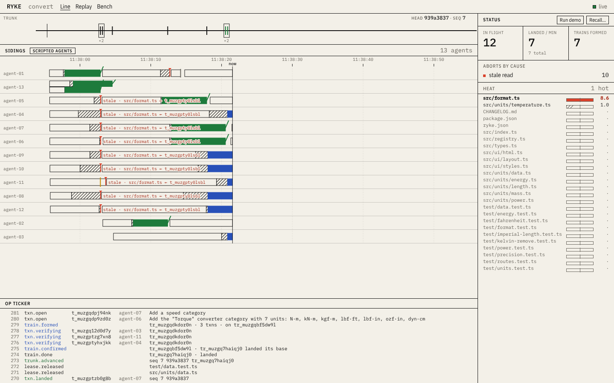
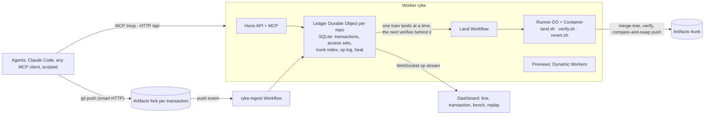

# Ryke — Git with transactions

Agents do not branch and open pull requests. In Ryke each change is a **transaction** against a
snapshot of trunk. Ryke records what the agent **read** and what it **wrote**, lands the change only
if nothing it read has changed since its snapshot, and otherwise aborts it and hands the agent the
exact delta to retry against. It is serializable snapshot isolation, applied to a codebase.

Built on Cloudflare Workers, Artifacts, Durable Objects, Workflows, Containers and Dynamic Workers.
Entry for the [Cloudflare next-Git-platform challenge](docs/challenge.md).
[How it works](docs/how-it-works.md) · [Deploy](docs/deploy.md)

| | Capability | What it means |
|---|---|---|
| P1 | Read-set validation | Silent semantic conflicts (two changes that merge cleanly but break trunk) become early aborts with a delta |
| P2 | Merge trains with bisection | Transactions that do not touch each other's writes land together on one test run; a bad one is isolated in about log₂(n) runs |
| P3 | Contention control | Ryke measures heat per file, warns agents live, and makes writers wait only on files that are hot |
| P4 | Fleet recall | One command removes everything an agent or model version landed and revalidates what depended on it |

Plus an evidence gate where nobody reads diffs: protected paths (existing tests, the policy file)
cannot be changed, hard checks run in code, judgement calls go to Jev (a calibrated model with typed
answers), and low confidence goes to a human.

## Quickstart (local, no Cloudflare account)

```sh
npm ci
npm run dev:all            # store, runner and the Worker + dashboard on http://127.0.0.1:5173
# in a second terminal:
npm run swarm -- --mode scripted --agents 12 --fresh
open "http://127.0.0.1:5173/?repo=convert"
```

Twelve scripted agents work through a 40-task catalogue on a small unit-converter app
([demo/convert](demo/convert)): new categories land in trains, a rounding change makes every
in-flight change that read `src/format.ts` stale, duplicates are flagged at begin, a test-tampering
change is rejected, and a sloppy model's changes wait to be recalled with
`npm run ryke -- recall --model sloppy-v0`. The swarm prints which of its acceptance criteria held.

Node 22.18 or later (tested on 22.22) and git 2.40 or later (tested on 2.43; trains merge with
`git merge-tree --merge-base`) are the only requirements. Jev, the judge, runs live when
`TYPESAFE_API_KEY` is set in your environment. Without it the evidence gate runs only its hard checks
and begin screening is off, so duplicates are not flagged at begin.

## Dashboard



The **Line** (`#/`) puts every agent's transactions on one time axis under trunk: grey while the agent
works, striped while it waits for a train, blue under test, green when it lands. A red notch is a read
that went stale; a guide drops from the landing that caused it, with a branch to every change it caught.
Counters, the hot files and a feed of what just happened sit beside it; hover a bar for its story, click
it for the **Transaction** (`#/t/:id`): each attempt, the read and write sets with the trunk delta of a
stale path, the judge's verdict on each acceptance criterion, the tests and the verify screenshot.
**Replay** (`#/replay`) draws the Line at any point of the op log at 1×, 4× or 16×, **Bench** (`#/bench`)
compares the three landing policies, and **Recall…** plans and runs a recall. Light and dark follow the
system, or the switch in the top bar. Every view, both sizes and both schemes: [docs/shots](docs/shots).

## Real agents: Claude Code or Codex, on your own subscription or key

`--mode claude` runs Claude Code and `--mode codex` runs Codex, each the vendor's own CLI, unmodified,
one session per transaction attempt. `--auth` says whose account the agents run on:

| `--auth` | Claude Code | Codex |
|---|---|---|
| `subscription` | your login on this machine: `claude`, then `/login` with Pro or Max, or `claude setup-token` | `codex login` with your ChatGPT plan |
| `api-key` | `ANTHROPIC_API_KEY` | `CODEX_API_KEY` or `OPENAI_API_KEY` |
| `auto` (default) | the key when one is set, otherwise your login | the same |

```sh
npm i -g @anthropic-ai/claude-code@2.1.293 @openai/codex@0.161.0
claude                       # once: /login, then /exit     (Codex: codex login)
npm run swarm -- --mode claude --auth subscription --agents 3 --stack --fresh
npm run swarm -- --mode codex --auth subscription --agents 3 --stack --fresh
OPENAI_API_KEY=sk-… npm run swarm -- --mode codex --auth api-key --agents 6 --stack --fresh
```

Before any transaction begins, the swarm asks the CLI which login it has (`claude auth status`,
`codex login status`) or tries the key with a free call, and stops with what to fix. A subscription run
gives its jobs no credential at all: the CLI uses the login it already has. Ryke never reads, stores or
forwards that login, takes every key out of the CLI's environment so it cannot fall back on one, and
refuses a subscription on a runner that is not this machine or inside a Ryke container. This is for one
person running agents on their own work, which is what Anthropic's terms allow for a Claude
subscription ([DECISIONS.md](DECISIONS.md)). All agents of a swarm share that one plan's usage limits,
so a subscription swarm is a few agents, not fifty. Hosted Ryke runs agents on the operator's API keys
only, and the gateway attaches them.

Codex has no hooks Ryke installs. Ryke takes its reads from the commands it runs (`cat`, `sed -n`,
`rg`, `find`) and their output, and reports each file it patches as a write intent. Codex never waits
for a lease. `npm run e2e:claude` and `npm run e2e:codex` run both modes against stubs of the CLIs.

## Architecture



Locally `npm run dev:all` swaps two adapters: a Node service with the real git CLI
stands in for Artifacts (same API, token format and push events), and the container job scripts run as
host processes, which isolate nothing. The Worker, the Ledger, the workflows and the dashboard are the same code.

## Bench

Landed changes per minute, 120 s per cell on one 4-vCPU VM, zero trunk breakages in every cell
(`npm run bench -- --agents 10,50,100,200 --policy lock,queue,ryke --duration 120`):

| agents | lock (global mutex) | queue (merge queue) | ryke |
| ------ | ------------------- | ------------------- | ---- |
| 10     | 6.5                 | 23                  | 24.5 |
| 50     | 5.5                 | 23                  | 61.5 |
| 100    | 5.5                 | 18.5                | 75.5 |
| 200    | 6                   | 22                  | 43.5 |

The bench agents are synthetic: real git, real merges, real tests, scripted edits, about 10 % of
read-overlapping pairs semantically incompatible. At 10 agents Ryke and the merge queue are level.
At 200, Ryke's throughput falls from its peak: 383 of its 390 stale aborts hit changes that were
already waiting for a train when trunk moved under them. Full numbers, caveats and the chart:
[bench/results/latest.md](bench/results/latest.md); the dashboard's `#/bench` view renders the same JSON.

Two parts of Ryke switched off one at a time, on the same bench
([bench/results/ablation/latest.md](bench/results/ablation/latest.md)):

- **Hot-file leases.** Without them Ryke lands 42.5 against 67 per minute at 50 agents, with 260
  against 118 stale aborts; at 100 agents 38.5 against 73, and 462 against 317.
- **Speculative pipelining** (the next train verifies on the candidate of the train landing). Without
  it Ryke lands 58 against 67 per minute at 50 agents and 55.5 against 73 at 100. At 200 agents three
  runs gave 28.5, 44.5 and 53 with it, against 36, 36.5 and 37.5 without
  ([repeats](bench/results/ablation/repeats)). It wins on average there too, but varies more from run
  to run: a train that bisects also throws away the train verifying behind it.

## Commands

| Command | What it does |
|---|---|
| `npm test` | Worker suites in workerd (vitest) plus Node suites for the store, runner, job scripts, demo patches and harness |
| `npm run e2e:land` | Trains, a stale abort with its delta, bisection of a broken change, green trunk |
| `npm run e2e:recall` | A full swarm, then recall of `sloppy-v0` with cascade and re-queue, green trunk |
| `npm run swarm -- --mode scripted --agents 12 --fresh` | The demo run (`--speed`, `--contention on|off`, `--stack`) |
| `npm run swarm -- --mode claude --agents 3 --stub` | The Claude Code agent mode with its hooks, against a stub binary (`--mode codex` for Codex; `--auth subscription\|api-key\|auto`) |
| `npm run e2e:claude`, `npm run e2e:codex` | Both agent modes end to end against their stubs: landings, retries, the protected-path rejection, green trunk |
| `npm run bench` | Lock vs merge queue vs Ryke at 10–200 synthetic agents |
| `npm run jev:calibrate` | Jev accuracy on labelled cases → [docs/jev-calibration.md](docs/jev-calibration.md) |
| `npm run shots` | Dashboard screenshots of every view at 1440×900 and 390×844, light and dark, failing on any console or page error → [docs/shots](docs/shots) |
| `npm run deploy:dry` | Production build and `wrangler deploy --dry-run` |

## Honest limits

- Workers Paid was not active while this was built: the Artifacts adapter, the container Runner and
  the ingest trigger are tested against fakes and the local stand-ins, not against Cloudflare
  ([BLOCKERS.md](BLOCKERS.md)).
- Read tracking is per file. A Claude agent that reads through `cat` in a shell instead of the Read
  tool is not tracked. A Codex agent is tracked only through the files its commands name or print, so
  a script that opens files on its own is missed. Untracked transactions are treated as having read
  every file next to what they wrote.
- The scripted demo agents apply prepared patches. Claude Code and Codex agents use the same API; here
  they ran only against stubs. The real Claude CLI ran three short sessions to check the hook format;
  the real Codex 0.161.0 CLI was run only to check its flags, `login status` and event stream, because
  this VM cannot reach OpenAI. A real swarm needs your own login or key ([BLOCKERS.md](BLOCKERS.md)).
- In process mode jobs run as you. The code your agents write and test can read your CLI login under
  your home directory, as it can when you run the CLI yourself. Only container mode keeps a job away
  from its host.

## License

[MIT](LICENSE)
