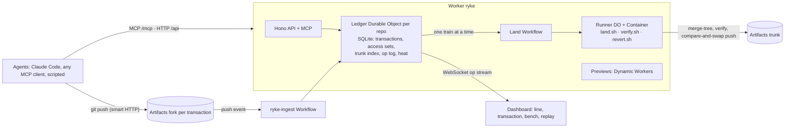

# Ryke — Git with transactions

Agents do not branch and open pull requests. In Ryke each change is a **transaction** against a
snapshot of trunk. Ryke records what the agent **read** and what it **wrote**, lands the change only
if nothing it read has changed since its snapshot, and otherwise aborts it and hands the agent the
exact delta to retry against. It is serializable snapshot isolation, applied to a codebase.

Built on Cloudflare Workers, Artifacts, Durable Objects, Workflows, Containers and Dynamic Workers.
Entry for the [Cloudflare next-Git-platform challenge](docs/challenge.md).
[How it works](docs/how-it-works.md) · [Deploy](docs/deploy.md)

| | Capability | What it means |
|---|---|---|
| P1 | Read-set validation | Silent semantic conflicts (two changes that merge cleanly but break trunk) become early aborts with a delta |
| P2 | Merge trains with bisection | Transactions that do not touch each other's writes land together on one test run; a bad one is isolated in about log₂(n) runs |
| P3 | Contention control | Ryke measures heat per file, warns agents live, and makes writers wait only on files that are hot |
| P4 | Fleet recall | One command removes everything an agent or model version landed and revalidates what depended on it |

Plus an evidence gate where nobody reads diffs: protected paths (existing tests, the policy file)
cannot be changed, hard checks run in code, judgement calls go to Jev (a calibrated model with typed
answers), and low confidence goes to a human.

## Quickstart (local, no Cloudflare account)

```sh
npm ci
npm run dev:all            # store, runner and the Worker + dashboard on http://127.0.0.1:5173
# in a second terminal:
npm run swarm -- --mode scripted --agents 12 --fresh
open "http://127.0.0.1:5173/?repo=convert"
```

Twelve scripted agents work through a 40-task catalogue on a small unit-converter app
([demo/convert](demo/convert)): new categories land in trains, a rounding change makes every
in-flight change that read `src/format.ts` stale, duplicates are flagged at begin, a test-tampering
change is rejected, and a sloppy model's changes wait to be recalled with
`npm run ryke -- recall --model sloppy-v0`. The swarm prints which of its acceptance criteria held.

Node 22.18+ (or 24) and git are the only requirements. Jev, the judge, runs live when
`TYPESAFE_API_KEY` is set in your environment. Without it the evidence gate runs only its hard checks
and begin screening is off, so duplicates are not flagged at begin.

## Architecture



Locally `npm run dev:all` swaps two adapters: a Node service with the real git CLI
stands in for Artifacts (same API, token format and push events), and the container job scripts run as
host processes, which isolate nothing. The Worker, the Ledger, the workflows and the dashboard are the same code.

## Bench

Landed changes per minute, 120 s per cell on one 4-vCPU VM, zero trunk breakages in every cell
(`npm run bench -- --agents 10,50,100,200 --policy lock,queue,ryke --duration 120`):

| agents | lock (global mutex) | queue (merge queue) | ryke |
| ------ | ------------------- | ------------------- | ---- |
| 10     | 7                   | 25.5                | 22   |
| 50     | 5.5                 | 24                  | 58   |
| 100    | 5.5                 | 19                  | 68   |
| 200    | 6.5                 | 24.5                | 38.5 |

The bench agents are synthetic: real git, real merges, real tests, scripted edits, about 10 % of
read-overlapping pairs semantically incompatible. At 10 agents the merge queue is faster. At 200,
Ryke's throughput falls: one train lands at a time, and 464 of its 466 stale aborts hit changes that
were already waiting for a train when trunk moved under them. Full numbers, caveats and the chart:
[bench/results/latest.md](bench/results/latest.md); the dashboard's `#/bench` view renders the same JSON.

## Commands

| Command | What it does |
|---|---|
| `npm test` | Worker suites in workerd (vitest) plus Node suites for the store, runner, job scripts, demo patches and harness |
| `npm run e2e:land` | Trains, a stale abort with its delta, bisection of a broken change, green trunk |
| `npm run e2e:recall` | A full swarm, then recall of `sloppy-v0` with cascade and re-queue, green trunk |
| `npm run swarm -- --mode scripted --agents 12 --fresh` | The demo run (`--speed`, `--contention on|off`, `--stack`) |
| `npm run swarm -- --mode claude --agents 3 --stub` | The Claude Code agent mode with its hooks, against a stub binary |
| `npm run bench` | Lock vs merge queue vs Ryke at 10–200 synthetic agents |
| `npm run jev:calibrate` | Jev accuracy on labelled cases → [docs/jev-calibration.md](docs/jev-calibration.md) |
| `npm run shots` | Dashboard screenshots of every view, failing on any console error → [docs/shots](docs/shots) |
| `npm run deploy:dry` | Production build and `wrangler deploy --dry-run` |

## Honest limits

- Workers Paid was not active while this was built: the Artifacts adapter, the container Runner and
  the ingest trigger are tested against fakes and the local stand-ins, not against Cloudflare
  ([BLOCKERS.md](BLOCKERS.md)).
- Read tracking is per file. An agent that reads through `cat` in a shell instead of the Read tool is
  not tracked; untracked transactions are treated as having read every file next to what they wrote.
- The scripted demo agents apply prepared patches. Claude Code agents use the same API and hooks; here
  they ran only against a stub, plus three short runs of the real CLI to check the hook format. A real
  Claude swarm needs an Anthropic key ([BLOCKERS.md](BLOCKERS.md)).

## License

[MIT](LICENSE)
