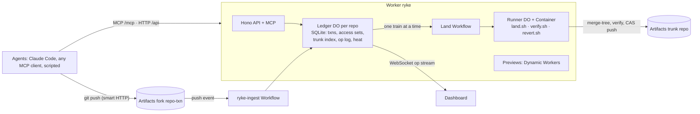

# How Ryke works

**Ryke is Git with transactions.** Agents do not branch and open pull requests. Each change is a
transaction against a snapshot of trunk. Ryke records what the agent **read** and what it **wrote**,
lands the change only if nothing it read has changed since its snapshot, and otherwise aborts it
with the exact delta to retry against. Databases call this serializable snapshot isolation. Ryke
applies it to a codebase.

## Why reads, not claims

Most multi-agent Git setups ask agents to declare up front which files they will touch, then warn on
overlapping claims. Agents misjudge their own footprint. The STORM study found cross-module scope
drift in about 90 % of failed multi-agent runs, and over 40 % of failures were semantic, not textual.

A text merge cannot see a semantic conflict. Here is the case Ryke is built for:

- Agent B reads `src/format.ts` to learn the rounding rule (2 decimals), then adds a test expecting
  `"1000.00"`.
- Agent A changes the rule to 3 digits with trailing zeros trimmed.
- The two diffs touch different files, so git merges them cleanly. Trunk breaks anyway.

Ryke aborts B before merging, because B **read** a file that changed after its snapshot, and hands B
the diff of `src/format.ts`. B retries on the new snapshot and lands. Nobody declared anything; the
read set came from what B actually read, through Claude Code hooks or the MCP read tool.

## A transaction, step by step

1. **Begin.** `ryke_begin` (MCP) or `POST /api/repos/:repo/txns` opens a transaction. Ryke forks the
   trunk into an Artifacts repo `<repo>--<txn>` and returns its remote, a write token and the
   snapshot sha.
2. **Work.** The agent clones its fork, works, and reports every file it reads. Claude Code agents
   do this through a PostToolUse hook on Read, Grep and Glob; other agents call `ryke_reads`.
   Unreported reads are not trusted: a transaction with none is treated as having read every file
   in the directories it wrote.
3. **Push and submit.** The agent pushes to its fork and calls submit. Ryke computes the write set
   from git, not from the agent.
4. **Validate.** The Ledger checks the read and write sets against an index of every path changed on
   trunk since the snapshot. No git is involved, so it takes microseconds:
   - a modified or deleted **protected** path (existing tests, `ryke.json`) → `rejected`;
   - any read or written path that changed since the snapshot → `stale`, with the path, the trunk
     sequence number that changed it and the transaction responsible;
   - otherwise `ready`. Paths the policy declares **union** (registries, changelogs) may change
     concurrently; git's union merge and the tests decide those.
5. **Land.** Ready transactions land in trains (below). The trunk only ever moves through a verified
   push.
6. **Retry.** A stale transaction calls retry and gets the new snapshot plus a unified diff per stale
   path. It rebases, pushes, submits again. After three bad attempts it is aborted.

Ryke also warns early: when the trunk advances, every open transaction that read one of the changed
paths gets a `stale.warning`, which the Claude Code hook injects into the agent's context on its next
tool call. The agent can adapt before it even submits.

## Trains and bisection

The Ledger forms a train from ready transactions in submit order, greedily adding each one that does
not touch what another member writes (two members may read the same file). The Land Workflow then:

1. **prepare**: merges each member onto the candidate with `git merge-tree`, using that member's own
   snapshot as the merge base, and makes one squash commit per transaction with `Ryke-Txn`,
   `Ryke-Agent`, `Ryke-Model`, `Ryke-Attempt` and `Ryke-Snapshot` trailers. A text conflict sends
   that member back as stale.
2. **verify**: runs the repo's test command once for the whole candidate.
3. **judge**: runs the evidence gate per transaction (below).
4. **bisect** when verify fails: it searches for the culprit by verifying prefixes, isolates it in
   about log₂(n) runs, fails it with the failing test names and lands everyone else.
5. **push**: a non-force push of the candidate to `main`. If anything else moved trunk, the push is
   rejected and the train is formed again: a compare-and-swap.
6. **commit**: the Ledger records one trunk row per transaction and the paths it changed.

Exactly one train lands at a time per repo, so trunk writes are serial while all the work before
them is parallel.

## Contention control

Ryke measures heat per file: an exponentially decayed count (half-life 5 minutes) of stale aborts and
text conflicts. A file is hot at heat 2. Writes stay fully optimistic everywhere except on hot files:
a PreToolUse hook asks for a short admission lease before an agent edits a file, and the Ledger makes
the agent wait only if the file is hot **and** another transaction that has not yet landed holds a
live lease on it. When the wait ends, the agent refreshes its transaction onto the trunk the holder
just moved and does its work there, instead of working on a snapshot that is about to go stale.
Leases last 90 seconds and agents give up waiting after 90 seconds, so a lease never deadlocks
anyone. Global locks collapse throughput; Ryke serialises only where its own data says conflicts
happen.

## The evidence gate

Nobody reads diffs. The gate decides per transaction after the train's tests pass:

- **Hard checks, in code:** verify exit code 0, zero failed tests, no protected path modified, no
  `.only(` or `skip(` added under `test/`. Agent text is never trusted for these.
- **Judgement calls, by Jev** (a calibrated model with typed answers): one yes/no per acceptance
  criterion ("does the evidence show it is met?") and one for scope creep. Below 0.35 fails; between
  0.35 and 0.70, or a write to a path the policy marks for humans, goes to `needs_human`, where a
  person approves or rejects on the dashboard. Calibration numbers are in
  [jev-calibration.md](jev-calibration.md).

At begin, Jev also screens a new intent against work in flight and work landed in the last 30
minutes: a clear duplicate is rejected, a likely duplicate or conflict comes back as a warning that
names the other transaction and its live footprint.

## Recall

`ryke recall --model sloppy-v0` (or `--agent`, or explicit transaction ids) removes everything that
selector landed. Ryke plans the targets and every transitive dependent (anything that later read or
wrote what a target wrote), reverts the targets newest first, and when a revert conflicts, reverts
the dependent that caused the conflict first. That dependent is recalled too and its intent comes
back as a new transaction for the same agent. The reverted trunk is verified before it is pushed;
if it fails, the dependents that relied on the targets go as well. Dependents that revert cleanly
stay landed, revalidated by that verify run.

## On Cloudflare

- **Artifacts** holds the trunk and one fork per transaction; only the lander writes trunk.
- **One Durable Object per repo** is the transaction ledger: SQLite tables for transactions, access
  sets, the trunk index and the op log, plus a WebSocket op stream with hibernation. The dashboard,
  the replay and the bench are all projections of that op log.
- **Workflows**: `ryke-land` runs one train with retryable steps; `ryke-ingest` turns Artifacts push
  events into fork heads.
- **Containers**: a Runner Durable Object per job slot drives a container that runs the same job
  scripts as local development. An outbound gateway attaches Artifacts tokens and the Anthropic key,
  so no long-lived secret enters a container. An agent job carries only its transaction's own token,
  which can report reads, submit, retry or abort that one transaction, and nothing else.
- **Dynamic Workers** bundle the demo app at any commit and serve a live preview of every landed
  transaction and every train candidate, sandboxed with a Content Security Policy.
- **MCP**: nine tools (`ryke_repo`, `ryke_begin`, `ryke_read`, `ryke_reads`, `ryke_submit`,
  `ryke_status`, `ryke_wait`, `ryke_retry`, `ryke_abort`) so any agent can join.

## What is real and what is not

- Everything in this document runs locally with `npm run dev:all`: the real Worker in workerd, real
  git, real merges, real tests. Locally a Node service stands in for Artifacts (same API, token
  format and push events) and another runs the container scripts as host processes, which isolate nothing. The production
  adapters (Artifacts binding, Runner containers) compile and have unit tests, but were not run
  against Cloudflare for this entry: the Artifacts adapter is tested against an in-memory fake of
  the binding, not the real service; see [deploy.md](deploy.md).
- The bench agents are synthetic: real git, real merges, real tests, scripted edits. The scripted
  demo agents apply prepared patches. Real Claude Code agents use the same API and hooks.
